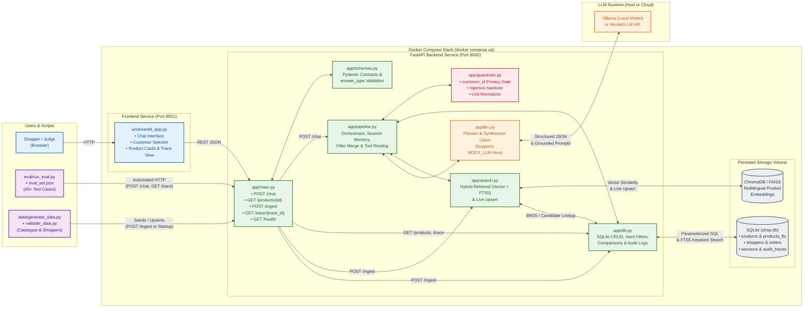

## Architecture

```mermaid
flowchart LR
    %% Styling
    classDef ui fill:#e3f2fd,stroke:#1565c0,stroke-width:2px,color:#0d47a1
    classDef core fill:#e8f5e9,stroke:#2e7d32,stroke-width:2px,color:#1b5e20
    classDef guard fill:#ffebee,stroke:#c62828,stroke-width:2px,color:#b71c1c
    classDef llm fill:#fff3e0,stroke:#ef6c00,stroke-width:2px,color:#e65100
    classDef db fill:#eceff1,stroke:#455a64,stroke-width:2px,color:#263238
    classDef cli fill:#f3e5f5,stroke:#6a1b9a,stroke-width:2px,color:#4a148c

    subgraph USERS["Users & Scripts"]
        SHOPPER["Shopper / Judge<br/>(Browser)"]:::ui
        EVAL["eval/run_eval.py<br/>+ eval_set.json<br/>(40+ Test Cases)"]:::cli
        DATAGEN["data/generate_data.py<br/>+ validate_data.py<br/>(Catalogue & Shoppers)"]:::cli
    end

    subgraph DOCKER["Docker Compose Stack (docker compose up)"]
        subgraph UI_SVC["Frontend Service (Port 8501)"]
            STREAMLIT["ui/streamlit_app.py<br/>• Chat Interface<br/>• Customer Selector<br/>• Product Cards & Trace View"]:::ui
        end

        subgraph API_SVC["FastAPI Backend Service (Port 8000)"]
            MAIN["app/main.py<br/>• POST /chat<br/>• GET /products/{id}<br/>• POST /ingest<br/>• GET /trace/{trace_id}<br/>• GET /health"]:::core
            SCHEMAS["app/schemas.py<br/>Pydantic Contracts &<br/>answer_type Validation"]:::core
            PIPE["app/pipeline.py<br/>Orchestrator, Session Memory,<br/>Filter Merge & Tool Routing"]:::core
            GUARD["app/guardrails.py<br/>• customer_id Privacy Gate<br/>• Injection Sanitizer<br/>• Unit Normalizer"]:::guard
            DB_MOD["app/db.py<br/>SQLite CRUD, Hard Filters,<br/>Comparisons & Audit Logs"]:::core
            SEARCH_MOD["app/search.py<br/>Hybrid Retrieval (Vector + FTS5)<br/>& Live Upsert"]:::core
            LLM_MOD["app/llm.py<br/>Planner & Synthesizer Client<br/>(Supports MOCK_LLM=true)"]:::llm
        end

        subgraph STORAGE["Persisted Storage Volume"]
            SQLITE[("SQLite (shop.db)<br/>• products & products_fts<br/>• shoppers & orders<br/>• sessions & audit_traces")]:::db
            VECTOR[("ChromaDB / FAISS<br/>Multilingual Product<br/>Embeddings")]:::db
        end
    end

    subgraph MODEL_SVC["LLM Runtime (Host or Cloud)"]
        LLM_ENG["Ollama (Local Model)<br/>or Hosted LLM API"]:::llm
    end

    %% Connections
    SHOPPER -->|"HTTP"| STREAMLIT
    STREAMLIT -->|"REST JSON"| MAIN
    EVAL -->|"Automated HTTP<br/>(POST /chat, GET /trace)"| MAIN
    DATAGEN -->|"Seeds / Upserts<br/>(POST /ingest or Startup)"| MAIN

    MAIN <--> SCHEMAS
    MAIN -->|"POST /chat"| PIPE
    MAIN -->|"GET /products, /trace"| DB_MOD
    MAIN -->|"POST /ingest"| SEARCH_MOD
    MAIN -->|"POST /ingest"| DB_MOD

    PIPE <--> GUARD
    PIPE <--> DB_MOD
    PIPE <--> SEARCH_MOD
    PIPE <--> LLM_MOD

    DB_MOD <-->|"Parameterized SQL<br/>& FTS5 Keyword Search"| SQLITE
    SEARCH_MOD <-->|"Vector Similarity<br/>& Live Upsert"| VECTOR
    SEARCH_MOD <-->|"BM25 / Candidate Lookup"| DB_MOD

    LLM_MOD <-->|"Structured JSON<br/>& Grounded Prompts"| LLM_ENG
```